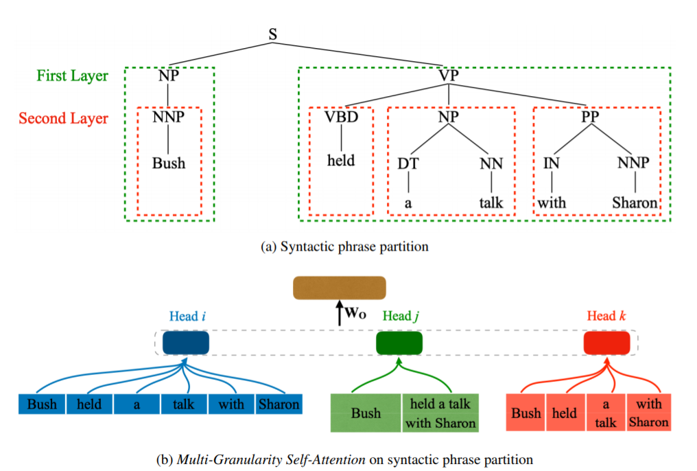
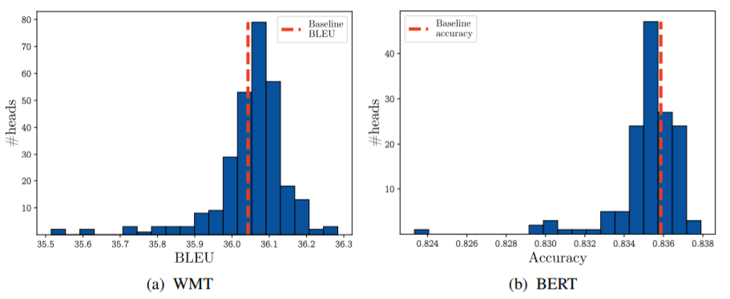

[TOC]

# 百变Self-Attention 

#### 导读

> *维护了一个NLP论文集仓库：<https://github.com/PengboLiu/NLP-Papers>*

首先简单讲一下Self Attention。

Self Attention原本是Transformer中的一个结构，现在很多时候也被单独拿出来作为一个特征抽取器。输入是一个Query向量，一个Key向量和一个Value向量。在Self Attention中，三者相同。$d_k$ 是模型维度。
$$
\text { Attention }(Q, K, V)=\operatorname{softmax}\left(\frac{Q K^{T}}{\sqrt{d_{k}}}\right) V
$$
如果是Multi-Head Attention，那就把多个Attention拼在一起。
$$
\text { MultiHead }\left.(Q, K, V)=\text { Concat (head_ }_{1}, \ldots, \text { head_ }\right) W^{O}
$$
简单粗暴又有效，那么能不能对这种结构进行一些改进呢？

首先是EMNLP 2019中，腾讯AI LAB的三篇关于改进SANs的论文。（本文中，Self Attention Networks简记为SANs）

------

#### [Self-Attention with Structural Position Representations](https://arxiv.org/pdf/1909.00383.pdf)

在Transformer中，SANs本身不能表示句子结构的，句子的序列信息是靠“position encoding”得到的。

本文对此进行改进，在SANs中融合了结构性的位置表示信息，以此增强SANs对句子潜在结构的建模能力。当然并没有舍弃原有的position encoding，**本文是把序列信息和结构信息一并使用**。

**结构化位置表示：**position encoding是根据句子中单词的实际位置建模，而本文引入了依存句法树表示单词之间的关系。直觉上来说，这种方法能挖掘出更多关于句子中各个词语之间的依存信息。

本文介绍了两种位置：绝对结构位置和相对结构位置（使用Stanford Parser）

- 绝对结构位置：把主要动词作为原点，然后计算依存树上每个单词到原点的距离；

- 相对结构位置：根据以下规则计算每两个单词之间的距离

  - 在依存树的一条边上，两个单词的绝对结构位置之差就是相对结构位置；

  - 如果不在同一条边，两个单词的绝对结构位置之和乘1（两个单词在句子中正序）或-1（两个单词在句子中正序逆序）或0（同一个单词）；

最后，序列绝对位置和结构绝对位置通过非线性函数结合在一起得到绝对位置的表示。至于相对位置，因为每个时间步的单词都不同，方法和绝对位置表示也不一样。这里，作者参考了[Self-Attention with Relative Position Representations](https://arxiv.org/pdf/1803.02155.pdf)中的方法。

作者在NMT和 Linguistic Probing Evaluation两个任务上进行试验，结果表明无论是相对结构位置还是绝对结构位置都能更好地在句法和语义层面上建模，从而达到更好的效果。

------

#### [Multi-Granularity Self-Attention for Neural Machine Translation](https://arxiv.org/pdf/1909.02222.pdf)

上一篇论文是利用Parser生成依存句法树进而改变SANs的输出，这篇论文则在SANs的结构做了一些改动，目的类似，也是为了增加句子的句法结构信息。

多粒度的Self Attention简称为MG-SA，结合多头注意力和短语建模。一方面，在多头注意力中拿出几个“头”在N元语法和句法维度对短语建模；然后，利用短语之间的相互作用增强SANs对句子结构建模的能力（还是structure modeling）。

本文的motivation有两方面：

1. 和上一篇论文类似，考虑短语模式学习句子的潜在结构；
2. 最近很多论文表明，SANs中很多“head”并没有被充分利用，这样何不试试把一些“head”做别的事情从而改善SANs的性能；

改进后的MG-SA如下：
$$
\mathbf{H}_{g}=F_{h}(\mathbf{H})
$$

$$
\mathbf{Q}^{h}, \mathbf{K}^{h}, \mathbf{V}^{h}=\mathbf{H} \mathbf{W}_{Q}^{h}, \mathbf{H}_{g} \mathbf{W}_{K}^{h}, \mathbf{H}_{g} \mathbf{W}_{V}^{h}
$$

$$
\mathbf{O}^{h}=\operatorname{ATT}\left(\mathbf{Q}^{h}, \mathbf{K}^{h}\right) \mathbf{V}^{h}
$$

$$
\mathrm{MG}-\mathrm{SA}(\mathbf{H})=\left[\mathbf{O}^{1}, \ldots, \mathbf{O}^{\mathrm{N}}\right]
$$

$ATT$ 就是经典的Self Attention，无需多言。可以看出，主要的改动在于 $\mathbf{H}_{g}​$（文章称之为生成的短语级记忆）。计算方法也就是文章提到的“Multi-Granularity”表示：

**多粒度表示(Multi-Granularity Representation)**

首先是得到短语划分并对其合成，如图（a），然后短语标签监督和短语交互可以进一步增强短语表示在结构上的建模能力。最终得到的MG-SA如图（b）。

- **短语划分（Phrase Partition）**：句子划分成若干个不重叠的长度为n个单词的短语。此外，又提出了句法级的短语划分（当然也要靠句法树），得到的短语输入为 $P_{\mathbf{x}}=\left(p_{1}, \dots, p_{M}\right)​$；

- **合成策略（Composition Strategies）**：$g_m = COM(p_m)​$ ，$COM​$一般是CNN、RNN或者是SANs；

- **短语标签监督（Phrase Tag Supervision）**：得到的 $g_m$，我们再使用它预测短语的标签（就是NP、VP、PP这些）

  预测方法（softmax）和损失函数（负对数似然）如下：
  $$
  p_{\theta_{i}}=\operatorname{softmax}\left(W_{t} g_{i}+b_{t}\right), i=1, \ldots, M
  $$

  $$
  \mathcal{L}_{t a g}=-\sum_{i=1}^{M} t_{i} \log p_{\theta_{i}}\left(t_{i}\right)
  $$

- **短语间的交互（Phrase Interaction ）**：想让句子的短语得到交互，直觉肯定是要引入循环式的结构（$REC$），那LSTM当之无愧了。本文采用了ICLR2019提出的Ordered Neurons LSTM （ON-LSTM，关于ON-LSTM的介绍，可以参考苏建林的博客 <https://kexue.fm/archives/6621>）。到此为止，我们终于得到了$H_g​$。
  $$
  H_g = REC(G_X)
  $$
  

**训练和实验**：

- 训练时的损失函数需要把刚才定义的短语标签预测损失加起来；
- 在机器翻译任务上做了若干组实验，并进行了可视化分析；
-  完成了 [Does string-based neural mt learn source syntax](https://www.isi.edu/natural-language/mt/emnlp16-nmt-grammar.pdf) 中的任务来评估MG-SA多粒度短语建模的能力。

------

#### [Towards Better Modeling Hierarchical Structure for Self-Attention with Ordered Neurons](https://arxiv.org/pdf/1909.01562.pdf)

看论文标题就知道，又是一篇对SANs结构改进的文章，而且也使用了刚才提到的ON-LSTM。本文的贡献有二：

1. 层次结构（要区别与上文的句法结构）可以更好地对SANs建模；
2. 证明了ON-LSTM对有助于NMT任务；

这里，我们主要看看对SANs的改进。
$$
\begin{array}{l}{\mathbf{H}_{\mathrm{RNNs}}^{K}=\mathrm{ENC}_{\mathrm{RNNS}}(\mathbf{X})} \\ {\mathbf{H}_{\mathrm{SANs}}^{L}=\mathrm{ENC}_{\mathrm{SANs}}\left(\mathbf{H}_{\mathrm{RNNS}}^{K}\right)}\end{array}
$$
其实就是输入先使用RNNs编码，然后得到的输出再用SANs编码。这里的RNN就是ON-LSTM，具体细节还是看苏神的博客就好。

最后，也没有直接去利用得到的SANs的输出，而是使用 Short-Cut Connection（就是类似Transformer中residual connection的结构）。也算是取之Transformer，用之Transformer。
$$
\widehat{\mathbf{H}}=\mathbf{H}_{\mathrm{ON}-\mathrm{L} \mathrm{STM}}^{K}+\mathbf{H}_{\mathrm{SANS}}^{L}
$$

------

#### [Tree Transformer: Integrating Tree Structures into Self-Attention](https://arxiv.org/pdf/1909.06639.pdf)

同样是来自EMNLP2019的paper，这篇paper对SANs的改进主要是在两个相邻单词之间增加了一个“Constituent Attention”模块，从而达到树结构的效果（也就是 Tree Transformer）。

图（A）是Tree Transformer的结构。以图为例，输入“the cute dog is wagging its tail”。在layer0，cute和dog组成一个“Constituent”，its和tail组成一个“Constituent”。在layer1，两个相邻的“Constituent”可能融合在一起，所以“Constituent”的尺寸是越来越大的，到最顶层就只有一个“Constituent”了。那么怎么划分一个“Constituent”呢？

文章引入了“Constituent Attention”、“ Neighboring Attention”和“Hierarchical Constraint”的概念。

首先是Neighboring Attention，q和k和经典的transformer结构中的意义相同。
$$
s_{i, i+1}=\frac{q_{i} \cdot k_{i+1}}{d}
$$

$$
p_{i, i+1}, p_{i, i-1}=\operatorname{softmax}\left(s_{i, i+1}, s_{i, i-1}\right)
$$

$$
\hat{a}_{i}=\sqrt{p_{i, i+1} \times p_{i+1, i}}
$$

得到的 $\hat{a}_{i}​$还需“Hierarchical Constraint”的处理，至于为什么后面会说。
$$
a_{k}^{l}=a_{k}^{l-1}+\left(1-a_{k}^{l-1}\right) \hat{a}_{k}^{l}
$$
最后一步，终于要计算“Constituent Attention”了！
$$
C_{i, j}=\prod_{k=i}^{j-1} a_{k}
$$
$C_{i, j}$由 $i，j$ 之间的 $a_k$ 连乘得到。不过这么做有个问题就是某个$a_k$特别小的话，连乘起来的结果会趋近于0，所以我们用对数和的形式代替它：
$$
C_{i, j}=e^{\sum_{k=i}^{j-1} \log \left(a_{k}\right)}
$$
“Constituent Attention”要怎么去用呢？并不是单独作为一个结构，而是在原有的attention概率分布前乘上这个“Constituent Attention”就好了。
$$
E=C \odot \operatorname{softmax}\left(\frac{Q K^{T}}{d}\right)
$$
在这，解释一下“Hierarchical Constraint”：因为attention的每一个layer，都不小于前一个layer，为了保证这种层次性，我们需要添加这样一种限制，使得每一层的“Constituent Attention”都要大于上一层的。

图（B）是整个Tree Transformer的结构，图（C）是Constituent Attention的热力图，可以看到，确实有了分块的效果。

值得一提的是，文章还单独一节介绍了Tree Transformer中的Neighboring Attention，可以看做一种无监督的parsing，也算是意料中的收货吧。

------

#### [Are Sixteen Heads Really Better than One?](https://arxiv.org/pdf/1905.10650.pdf)

NeurIPS 2019的文章，来自CMU Neubig团队，一篇偏重解释性的文章。

文章讨论的是SANs是不是真的需要那么多heads。讨论这件事，就需要删除掉一些heads做对比实验。head具体怎么删除呢？文章中的做法是将一些head参数矩阵置0进行mask。

- **去掉一个head的影响**

  
  - 在WMT模型中的encoder部分，分别将其中96（16heads*6层）个单独去掉。绝大部分的head被单独去掉BLEU反而有所提升，极少数的几个（4个）去掉之后效果会稍差。论文还做了一组实验，证明了：在inference阶段，绝大部分的head被单独去掉不会对效果有什么太大影响；
  - BERT中，同样单独去掉head，大概有50个head，在去掉其中一个的时候效果反而要好于原始bert模型。大部分的head在被单独的去掉的时候，效果不会损失太多。

- **只留下一个head**

  96个head去掉一个直观上一想确实不会有太大影响。作者又进一步删除掉更多的heads：在某个layer内只保留一个head。结果，无论是BERT还是NMT，对实验效果都没什么太大的影响。

  需要注意的是，机器翻译中，self attention保留一个head影响不大，但是Encoder-Decoder的attention则需要更多的head。

- **不同的数据集，head的重要程度相同吗？**

  论文给出的答案是基本呈正相关的。这里的是去掉某个head，然后分别在两个不同的数据集（MNLI-matched和MNLI-mismatche）中进行测试，观察这个head对效果的影响是否在两个数据集的表现一致。当然，这里的实验做的可能做的不够充分。

- **启发式迭代剪枝head**

  那么如果想在不同层之间同时去掉一些head呢？作者给出了一种启发式的策略。

$$
\begin{array}{l}{I_{h}=\mathbb{E}_{x \sim X}\left|\frac{\partial \mathcal{L}(x)}{\partial \xi_{h}}\right|} \\ {I_{h}=\mathbb{E}_{x \sim X}\left|\operatorname{Att}_{h}(x)^{T} \frac{\partial \mathcal{L}(x)}{\partial \operatorname{Att}_{h}(x)}\right|}\end{array}
$$

​	根据求导得到的 $I_h$，每次去掉10%的head。

之前知乎上有个问题： [为什么Transformer 需要进行 Multi-head Attention？](https://www.zhihu.com/question/341222779/answer/868039515)  相信这篇文章可以某种程度上回答一下此问题。当然，对head数量的探索，肯定不止于此。

------

#### [Analyzing Multi-Head Self-Attention: Specialized Heads Do the Heavy Lifting, the Rest Can Be Pruned](https://arxiv.org/pdf/1905.09418.pdf)

对head数量剪枝的还有ACL2019的这一篇。作者十分良心，写了篇博客解释自己的论文（<https://lena-voita.github.io/posts/acl19_heads.html>）。本文的实验非常非常详尽，如果看了上一篇文章还对head剪枝感兴趣不妨先看看这篇文章对应的博客。

文章的结论大概如下：

- 只有一小部分头对于翻译任务似乎很重要（上一篇文章也得到了类似的结论）；
- 重要的头有一到多个功能：位置、句法、低频词等；
- encoder端的head很多都可以被减掉（是不是又似曾相识）；

------

#### 总结与思考

读完几篇论文，做一个小小的总结：

- 目前的Transformer结构，encoder端的head是存在冗余的，Multi-Head其实不是必须的；
- 丢掉一些head反而能提升性能，大概有点像dropout？
- 不同的head似乎有不同的分工；
- 结构信息对文本建模很重要，无论是什么方法即使是Transformer；
- 目前对SANs的改造还比较浅层，不够大刀阔斧；

其实即便现在预训练语言模型方兴未艾，但是对于其依赖的多头注意力的机理还不是很清楚，还有很多相关工作没有完成。不妨让我们期待一下明年的ACL/EMNLP/NAACL上会对Transformer和SANs做出怎样的解释及改进吧！

